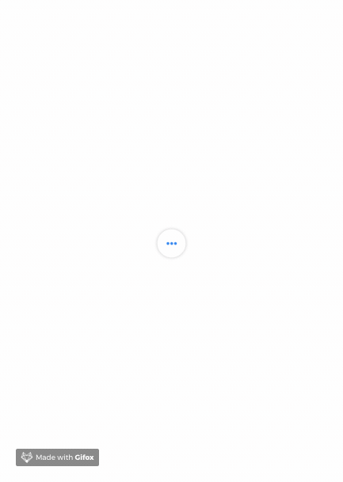

# YZDropdown

YZDropdown is a small dropdown library for selecting options.




## Usage
You can create YZDropdown in two ways:

### Passing only icons to initializer

```swift
let dropdown = YZDropdown(icons: [UIImage(), UIImage()])
```

### Passing ready buttons to initializer

```swift
let firstButton: UIButton(type: .system)
let secondButton: UIButton(type: .system)
let thirdButton: UIButton(type: .system)

let dropdown = YZDropdown(optionButtons: [firstButton,
                                          secondButton,
                                          thirdButton])
```
### Customization

```swift 
//You can pass extra expandedIcon parameter to init
let dropdown = YZDropdown(..., expandedButton: UIImage())

//Callback action on any dropdown options tapped
dropdown.optionSelection = { [weak dropdown] (tappedIndex) in
    print("option tapped at index: \(tappedIndex)")
    dropdown?.changeExpandedState() // public method to expand/collapse
}
```

## Contributing
Pull requests are welcome. For major changes, please open an issue first to discuss what you would like to change.

Please make sure to update tests as appropriate.

## License
No licenses